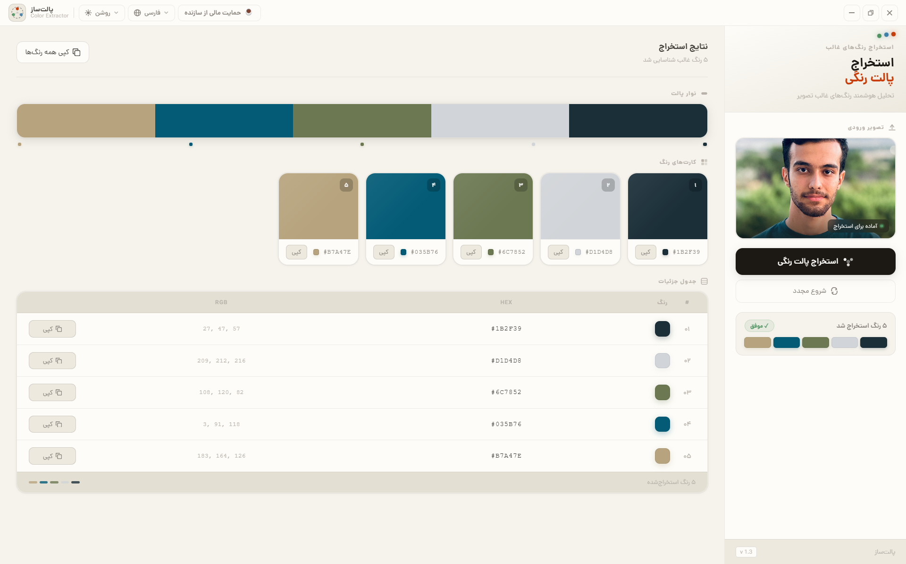
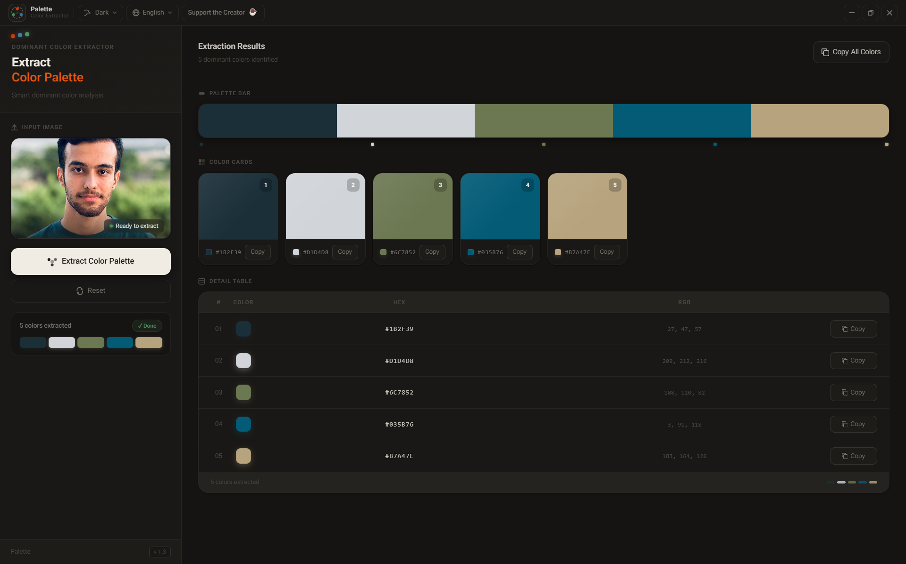
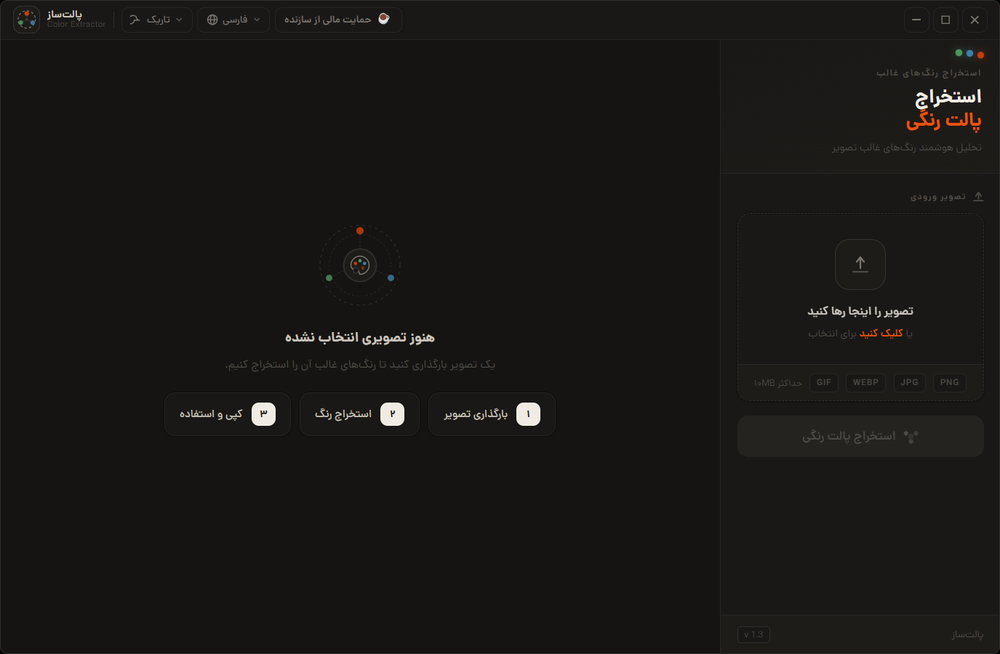

# 🎨 Color Palette Extractor

اپلیکیشن دسکتاپ برای استخراج پالت رنگی از تصاویر — سریع، آفلاین و کاملاً رایگان.

عکس خودتون رو بکشید و رها کنید (Drag & Drop)، برنامه با الگوریتم **K-Means** رنگ‌های غالب تصویر رو استخراج می‌کنه و به شما کد HEX هر رنگ رو می‌ده تا با یک کلیک کپی کنید.

<p align="center">
  
</p>

<p align="center">
  
  
  
  
</p>

---

## ✨ امکانات

- 🖱️ **Drag & Drop** — کشیدن و رها کردن تصویر برای تحلیل فوری
- 🎯 **استخراج هوشمند رنگ** با الگوریتم K-Means (قابل انتخاب تعداد رنگ‌های خروجی)
- 📋 **کپی سریع** هر رنگ به‌صورت HEX با یک کلیک، یا کپی کل پالت با هم
- 🌐 **دو زبانه** — فارسی (راست‌به‌چپ) و انگلیسی
- ⚡ **کاملاً آفلاین** — پردازش تصویر به‌صورت لوکال روی سیستم شما انجام می‌شه (بدون نیاز به اینترنت)
- 🖥️ رابط کاربری مدرن با فونت Dana و طراحی اختصاصی، بدون نوار عنوان پیش‌فرض ویندوز (Custom Titlebar)

---

## 📸 تصاویر برنامه

<p align="center">
  
</p>
<p align="center">
  
  
</p>

پشتیبانی کامل از تم روشن/تاریک و دو زبان فارسی و انگلیسی.

---

## 📥 دانلود و نصب (برای کاربران)

آخرین نسخه‌ی برنامه رو از بخش **[Releases](../../releases)** این مخزن دانلود کنید:

1. وارد صفحه‌ی [Releases](../../releases/latest) بشید
2. فایل با پسوند `.exe` (مثلاً `Color-Palette-Extractor-Setup-1.3.5.exe`) رو دانلود کنید
3. فایل رو اجرا کنید و مراحل نصب رو طی کنید (می‌تونید مسیر نصب رو هم تغییر بدید)
4. برنامه از روی دسکتاپ یا Start Menu در دسترس‌تونه

> ⚠️ چون این نصب‌کننده به‌صورت رسمی امضا نشده (Code Signing گرون‌قیمته)، ممکنه ویندوز یا SmartScreen هشدار «Unknown Publisher» نشون بده. کافیه روی **More Info → Run Anyway** بزنید.

فعلاً فقط نسخه‌ی **ویندوز (x64)** ارائه می‌شه.

---

## 🛠️ ساختار فنی پروژه

| بخش                    | تکنولوژی                               |
| ---------------------- | -------------------------------------- |
| Frontend               | React 18 + Vite + Tailwind CSS v4      |
| Desktop Shell          | Electron 35                            |
| Backend (پردازش تصویر) | Python + FastAPI + NumPy + Pillow      |
| بسته‌بندی بک‌اند       | PyInstaller (به exe مستقل تبدیل می‌شه) |
| بسته‌بندی نهایی        | electron-builder (NSIS Installer)      |

معماری برنامه: هنگام اجرا، Electron یک پردازه‌ی FastAPI (به‌صورت exe مستقل ساخته‌شده با PyInstaller) رو روی یک پورت آزاد لوکال بالا می‌آره و frontend با اون از طریق `http://127.0.0.1:<port>` ارتباط می‌گیره. کاربر نهایی نیازی به نصب Python نداره.

```
├── backend/              # سرویس FastAPI برای پردازش تصویر و K-Means
│   ├── main.py
│   ├── main_runner.py    # ورودی اجرای PyInstaller
│   └── build_backend.bat # اسکریپت ساخت backend.exe
│
└── frontend/             # اپلیکیشن Electron + React
    ├── electron/         # پردازه‌ی اصلی Electron (main/preload)
    ├── src/               # کد React (کامپوننت‌ها، i18n، context)
    └── scripts/build-win.js
```

---

## 💻 راه‌اندازی محیط توسعه (Development)

### پیش‌نیازها

- Node.js 18+ و npm
- Python 3.10+ و pip

### مرحله ۱ — Backend

```bash
cd backend
pip install -r requirements.txt
python main_runner.py --port 8000
```

### مرحله ۲ — Frontend (حالت توسعه، وب)

```bash
cd frontend
npm install
npm run dev
```

### مرحله ۳ — اجرای همزمان به‌صورت اپ دسکتاپ (Electron + Vite)

```bash
cd frontend
npm run electron-dev
```

---

## 📦 ساخت نسخه‌ی نصبی (Build)

### ۱) ساخت اجرایی بک‌اند (Windows)

```bash
cd backend
build_backend.bat
```

این اسکریپت با PyInstaller یک `backend.exe` مستقل در `backend/dist/backend` می‌سازه.

### ۲) ساخت نصب‌کننده‌ی نهایی (NSIS Installer)

```bash
cd frontend
npm run dist:win
```

خروجی در مسیر `frontend/dist-electron/` قرار می‌گیره (فایل `Setup.exe`).

> برای امضای دیجیتال نصب‌کننده، فایل `certs/certificate.pfx` و متغیر محیطی `WIN_CSC_KEY_PASSWORD` (در `.env`) لازمه. این فایل‌ها به‌عمد در `.gitignore` قرار دارن و **هرگز نباید در گیت‌هاب قرار بگیرن**.

---

## 🗺️ نقشه راه (Roadmap)

- [ ] پشتیبانی از macOS و Linux (ساختار build از قبل آماده‌ست)
- [ ] خروجی پالت به فرمت‌های اضافه (RGB, HSL, CSS Variables)
- [ ] ذخیره‌ی تاریخچه‌ی پالت‌های استخراج‌شده

## 👤 سازنده

ساخته‌شده توسط **Taha Nemati**
